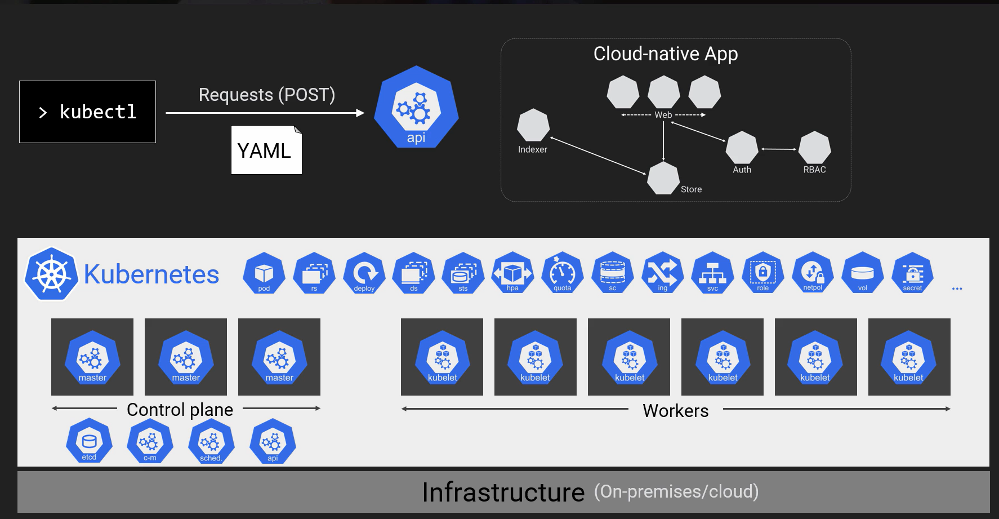
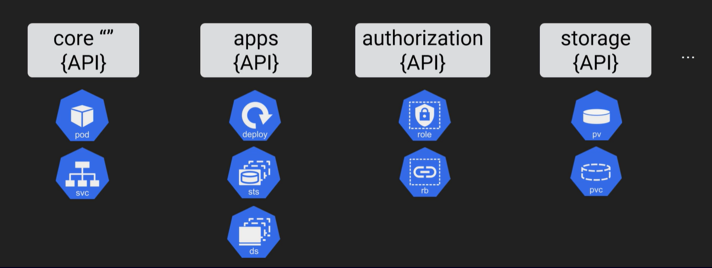

# Big picture

*Docker is a software platform used to create containerized applications. K8s automates the process of running
containerized*

## K8s Primer

*Cloud native app* - app build from small specialized components(usually containers) that is easy to scale and update
*Kubernetes* - is a platform of choice when it comes to running this could native apps

*Kubernetes cluster* is made of a bunch of linux nodes (VMs or cloud instances). Some of them form a control plane and
others the worker nodes.

*Control plane* - is a brain of the cluster. Composes: API server, scheduler, a bunch of controllers and persistent
storage (ectd)
*Workers* - Where you apps run



*YAML*  
You use YAML files to configure your K8s cluster and to change its *desired state*

## Control plane

API server, scheduler, a bunch of controllers and persistent

### ectd

*The only stateful part of control plane*

It is good for separation of concerns.
For a really big cluster you want to deploy a separate ectd cluster its own HA.

Note:
An *HA cluster with external etcd* is a topology where the distributed data storage cluster provided by etcd is external
to the cluster formed by the nodes that run control plane components.

### API server

*Central station of the control plane. **A place where everything in Kubernetes is defined***

* Exposes API and performs CRUD operations
* It is a REST-ful API that uses standard HTTP methods
* kubectl just posts our defined YAML files to the server through REST API

```text
> kubectl .... ------> Requests (POST YAML or text) to API server
```

#### API Groups

There are a bunch of API groups. The core API group is often referred to with empty quotes.


*SIGs (group of people)* look after API groups

```bash
> kubectl get appservices # for existing cluster get api services
```

## Kubernetes essentials

### Cluster

*A Kubernetes cluster is a set of nodes that run containerized applications.*

(Containerizing applications packages an app
with its dependences and some necessary services.) Kubernetes clusters allow containers to run across multiple machines
and environments: virtual, physical, cloud-based, and on-premises.

* Kubernetes clusters are comprised of one master node and a number of worker nodes.
* For production and staging, the cluster is distributed across multiple worker nodes. For testing, the components can
  all run on the same physical or virtual node.


### Control plane

*The container orchestration layer that exposes the API and interfaces to define, deploy, and manage the lifecycle of
containers.*

* In production environments, the control plane usually runs across multiple computers. Its components can be scaled
  horizontally (except for *ectd*).
* It is usually formed by it is formed by 1-3+ Master nodes

This layer is composed by many different components, such as (but not restricted to):

* [etcd](https://kubernetes.io/docs/concepts/overview/components/#etcd)
* [*kube-apiserver* API Server](https://kubernetes.io/docs/concepts/overview/components/#kube-scheduler)
* [*kube-schedule* Scheduler](https://kubernetes.io/docs/concepts/overview/components/#kube-scheduler)
* *kube-controller-manager* Controller Manager - controllers are control loops that watch the state of your cluster,
  then make or request changes where needed. Each controller tries to move the current cluster state closer to the
  desired state. Controllers watch the shared state of your cluster through the apiserver (part of the Control Plane).
* *cloud-controller-manager* Cloud Controller Manager

####   


* Note how Control plane is designed to scale horizontally

### Cluster's Master node

*Physical or Virtual Machine
that doesn’t run user workloads directly
but manages the cluster*

#### What does it do

The master node controls the state of the cluster; for example, which applications are running and their corresponding
container images. The master node is the origin for all task assignments. It coordinates processes such as:

* Scheduling and scaling applications
* Maintaining a cluster’s state
* Implementing updates

### Worker node

*Nodes are the machines, either VMs or physical servers, where Kubernetes place Pods to execute*

Every Kubernetes Node runs at least:

* **Kubelet**, a process responsible for communication between the Kubernetes control plane and the Node; it manages the
  Pods and the containers running on a machine.
* **A container runtime** (like Docker) responsible for pulling the container image from a registry, unpacking the
  container, and running the application.


### Pod

*The Pods are groups of containers that share networking and storage resources from the same node*

Each Pod is assigned an IP address, and all the containers in the Pod share the same storage, IP address, and port
space (network namespace).

## K8s Objects

Each time we define in YAML kind and api we define a Kubernetes object

```yaml
apiVersion: v1
kind: Service
...
```

### Pod

*High level construct that contains one or more containers; Atomic unit of scheduling*

So K8s does not run containers directly, only via Pods

It is:

* The smallest thing you can run on K8s
* **Object on the cluster**
* Defined in the **v1** (core) **API group**

But pods of their own don't give us a great deal, so we wrap them in a high level object "Deployment"

### Deployment

*Needed to make pods scalable, rolling updates*

It is:

* again object on the cluster
* defined in **apps/v1 API group**

### DaemonSet (DS)

*One pod per node*

Ensures that only one and only one of the specific pod will run on every worker in the cluster

### Stateful sets

*Stateful app components*

Stateful sets for pods of parts of your application with particular stateful requirements

### Other parts

* Volumes
* Secrets
* Load balancers


### Demo app organisation


After mapping the architecture of demo app to K8s object we end up with the following structure:

