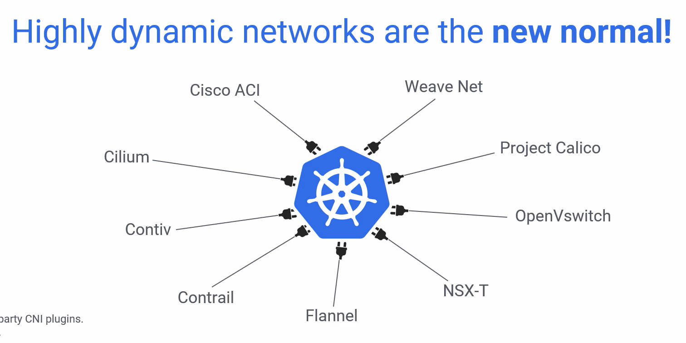
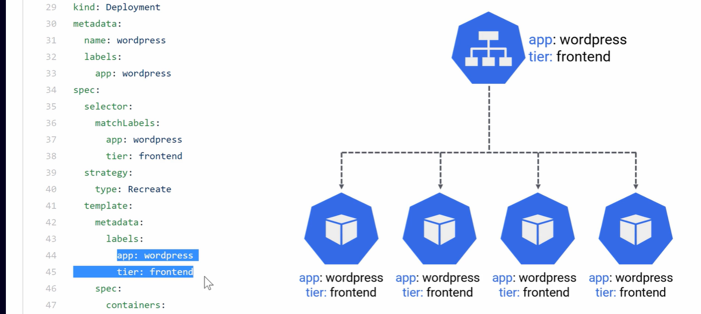
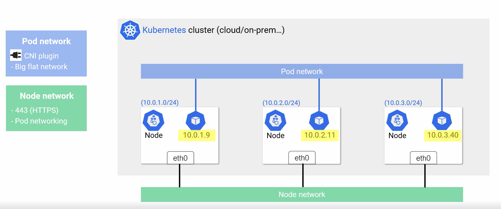
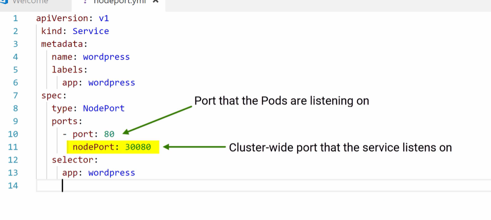
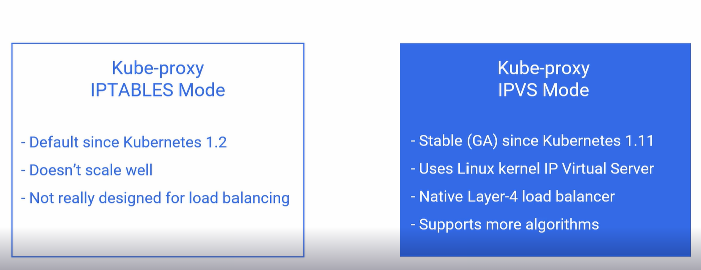
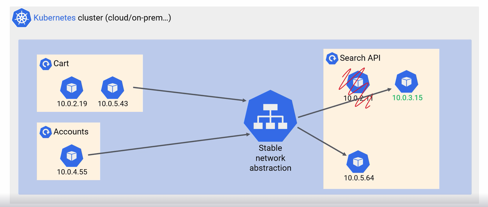
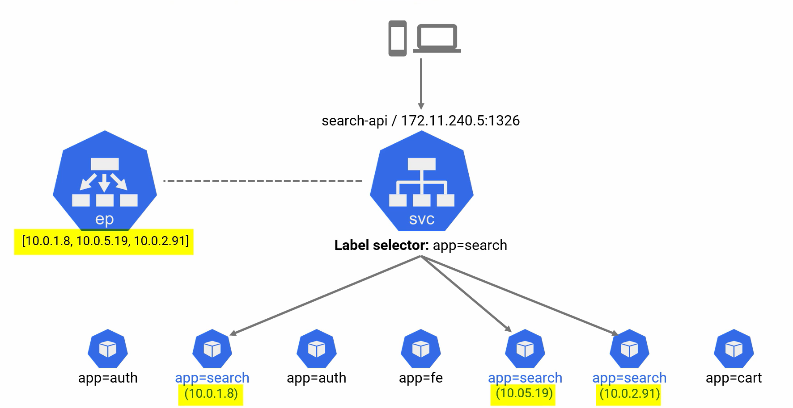

# Networking

Lesson plan:

* Common networking reqs
* Networking in the sample app
* Kubernetes Networking Basics
* Services
* Service Types
* The Service Network
* Lab
* Summary

## Common networking requirements

*In modern world: Networks are dynamic, scalable and have to handle massive IP churms(коливання, зміни у кількості), and
provide solid service discovery*

You have a lot of services that talk to each other and need to know for to find each other. That's why *Service
discovery* is needed.

Tools that help with organizing all this:


## Networking in the Sample App

1) We have an Load Balancer

```yaml
apiVersion: v1
kind: Service # Service
metadata:
  name: wordpress # This metadate means it will register name 'wordpress' with a cluster DNS -> you can ping it and reach it using the name 
  labels:
    app: wordpress # It is tagged as a part of WordPress frontend
spec:
  ports:
    - port: 80 # Service is listening of port 80
  selector: # Load balancer will balance traffic over pods with two labels below (see image below)
    app: wordpress
    tier: frontend
  type: LoadBalancer # And it has type of HTTP load balancer. If you are on a cloud - this will provision for you a public IP or DNS name of native cloud load balancer
---
```

2) Deployment  
   Tells us how to deploy our WordPress app as pods. From a network perspective this is important

```yaml
....
apiVersion: apps/v1 #  for k8s versions before 1.9.0 use apps/v1beta2  and before 1.8.0 use extensions/v1beta1
kind: Deployment # Deployment object for Frontend
metadata:
  name: wordpress
  labels:
    app: wordpress
spec:
  template:
    metadata:
      labels:
        app: wordpress # LABELS TO WHICH WE PROXY TRAFFIC (set in Load Balancer)
        tier: frontend # LABELS TO WHICH WE PROXY TRAFFIC (set in Load Balancer)
    spec: # This pod only defines single container spec
      containers:
        - image: wordpress:4.8-apache # Based on this container image.| Refers to docker image that has required code in it
          name: wordpress
          env: # Have env values
            - name: WORDPRESS_DB_HOST
              value: wordpress-mysql
            - name: WORDPRESS_DB_PASSWORD
              valueFrom:
                secretKeyRef:
                  name: mysql-pass
                  key: password
          ports:
            - containerPort: 80 # THIS PART. It says that the application inside the container is configured to listen on port 80
              name: wordpress
          volumeMounts: # Persistent storage
            - name: wordpress-persistent-storage
              mountPath: /var/www/html
...
```

Our container has the needed label so proxying will work. Note that every of this container listens to port 80 as is
said in ```containerPort: 80```


## K8s Network Basics

Basic house rules:

* All nodes in the cluster have to be able to talk to each other (this can be changed with addons)
* All pods on the network can communicate with each other without NAT
* Every pod get its own IP address
* Each node gets allocated a subset of IP addresses (e.g. 10.0.1.0/24)

*NAT* - Network address translation

There are 2 types of Networking:

* Pod Network
* Node Network



*K8s does not implement Node Network and Pod Network*. For Pod Network K8s introduces only Container Network Interface (
CNI) and then third-parties provide the plugins that implement the Pod Network.

## K8s Services (SVC)

*A Service in Kubernetes is an abstraction which defines a logical set of Pods and a policy by which to access them.*

*Think of them like load balancers of proxies*

Services enable a loose coupling between dependent Pods.  
A Service is defined using YAML (preferred) or JSON, like all
Kubernetes objects. The set of Pods targeted by a Service is usually determined by a LabelSelector (see below for why
you might want a Service without including a selector in the spec).

**Although each Pod has a unique IP address, those IPs are not exposed outside the cluster without a Service.** Services
allow your applications to receive traffic. Services can be exposed in different ways by specifying a type in the
ServiceSpec:

* **ClusterIP** (default) - Exposes the Service on an internal IP in the cluster. **This type makes the Service only
  reachable
  from within the cluster.**
* **NodePort** - **Exposes the Service on the same port of each selected Node in the cluster using NAT**. Makes a
  Service accessible **within** the cluster
  using: ```{selected Nodes IP in a cluster}:{specified NodePort that selected Nodes expose}```
  OR ```{NodePort Service Cluster IP}:{Port that pods listen to}```.
  Superset of ClusterIP. Default range of NodePort is between 30 000 and 32
  767. [See NodePort Lab](./cloudguru-labs/lesson-networking/nodeport.md).
* **LoadBalancer** - Creates an external load balancer in the current cloud (if supported) and assigns a fixed, external
  IP to the Service. Superset of NodePort.
* **ExternalName** - Maps the Service to the contents of the externalName field (e.g. foo.bar.example.com), by returning
  a
  CNAME record with its value. No proxying of any kind is set up. This type requires v1.7 or higher of kube-dns, or
  CoreDNS version 0.0.8 or higher.

They are specified in .yaml file with:

```yaml
apiVersion: v1
kind: Service // DEFINES THAT THIS YAML IS ABOUT SERVICES
metadata:
  name: wordpress
  labels:
    app: wordpress
spec:
  ports:
    - port:80
  selector:
    app: wordpress
    tier: frontend
  type: LoadBalancer // SERVICE TYPE

```

Node port example:


**Standart service routing uses Kube proxy. It does not scale well. For better scalling Kube-proxy IPVS Mode should be
used**


### Stable Network Abstraction (Services)

Pods come and go (due to higher demand or crashes) so we cannot rely on their IPs. Stable Network Abstraction keeps
track of alive Pods updates ep, when request comes gets a Pod IP from ep (as it is always up to date) and sends requests
to specific Pods.


* **Every Service has a name and IP**.
* **Name and IP are Stable**. K8s guarantees that once you created them - their name and IP will never change for a
  lifetime.
* Name and IP gets registered with cluster's built in DNS or add-on DNS. (so Every K8s cluster has a native DNS service,
  and every Pod in a cluster knows how to use it)
* The service object is always watching the API server to see if new Pods that match its selector are being added or
  removed. And as they are - it automatically **updates the endpoint object**

SVC takes a requests, gets its label and balances the requests between Pods with this label


#### Endpoint object (ep)

**To ensure that Pods are alive and ready to receive requests** - **endpoint object (ep)** is created in background.

**endpoint object (ep)** is a list of IPs of Pods that match the label selector.
