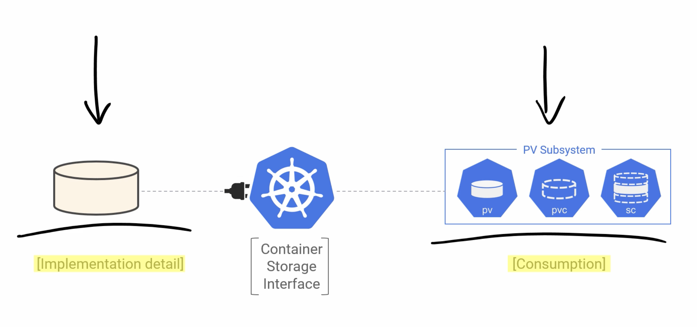
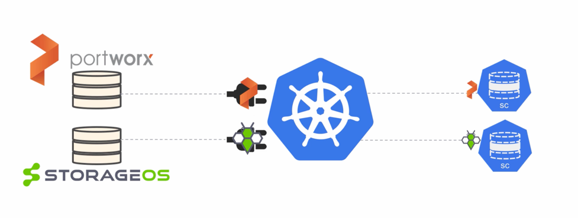
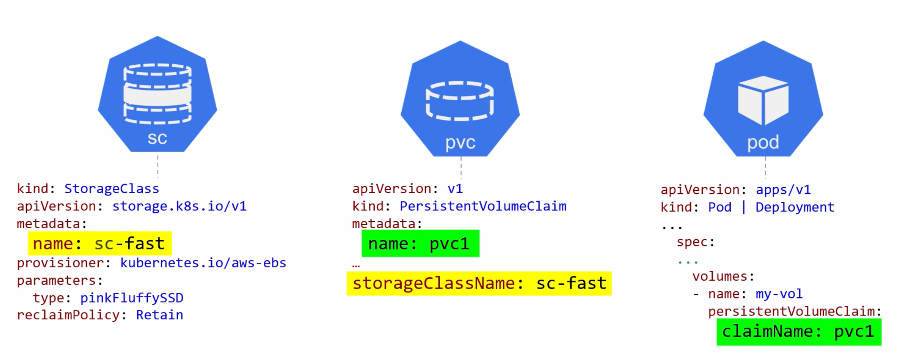

# Kubernetes storage

*Kubernetes volumes are all about decoupling storage from Pods*

* If pods wants to use a volume - it need to lay a claim to it and mount it. Then if the pods dies - the volume still
  exist.
* Multiple pods can share the same volume

**CSI** - Container Storage Interface - allows storage providers to write plugins that expose features to Kubernetes.

### PVC

Three modes for pods to access volume (not all volumes support all modes):

* RWO: ReadWriteOnce
* RWM: ReadWriteMany
* ROM:

Reclaim Policy (what cluster does when a claim on a volume is released):

* Retain (default)
* Delete

For the claim to work against PV - This has to match:

* Access mode
* Storage Class name
* Storage capacity (claim can for less, and it still will work; but not for more)

### Storage classes

*Makes storage dynamic*

Manual provisioning storage for pods does not scale. The answer is Dynamic Provisioning with Storage classes.

* Each storage class refer to each storage backend
* Storage class is an API resource that is defined in a YAML file

